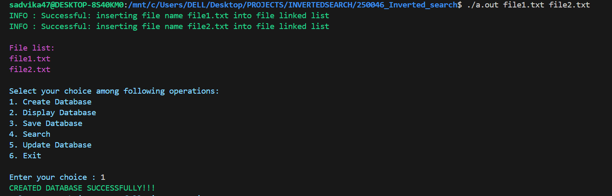
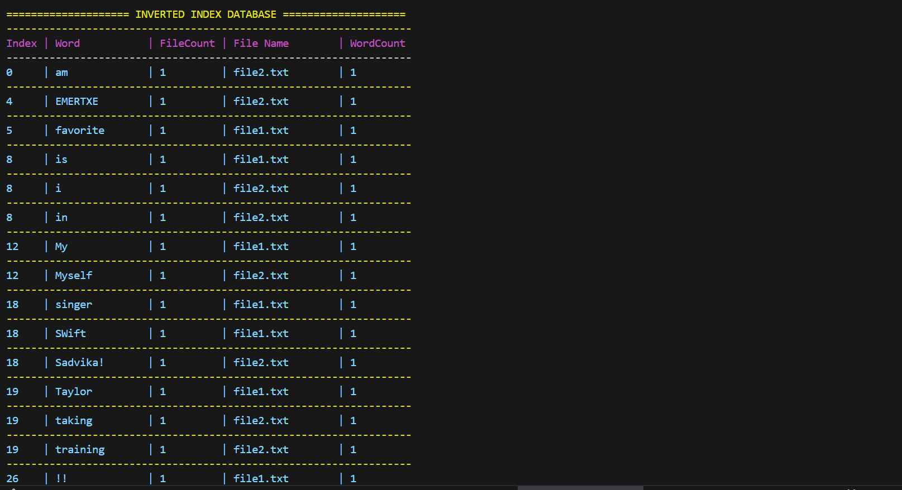
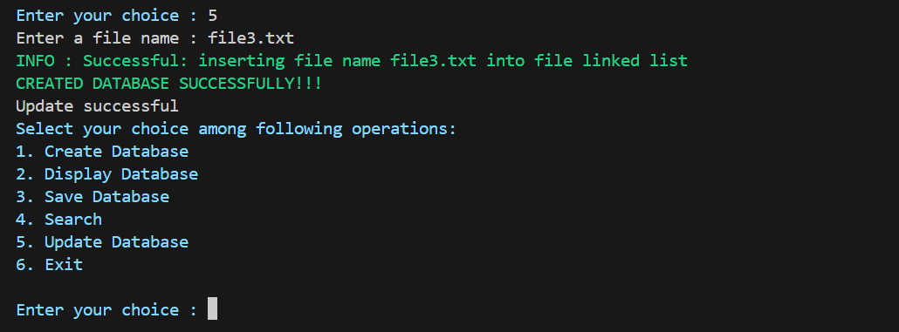
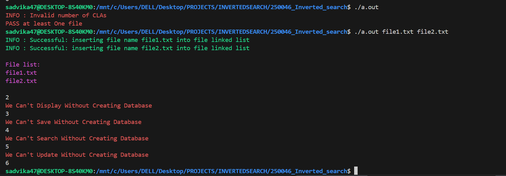

# inverted-search-c
## Inverted Search Engine in C

A complete Inverted Search Engine implemented in C language that indexes words from multiple text files and enables fast searching using hash tables and linked lists.
This project demonstrates strong fundamentals of:
- Data Structures
- File Handling
- Hashing
- Modular Programming
- Real-time search logic

## Project Overview
An Inverted Index maps each word to the list of files in which it appears, along with the frequency of occurrence.
This structure is widely used in:
- Search engines
- Document indexing systems
- Database indexing
- Information retrieval systems
### This project creates a mini search engine that:
- Reads multiple text files
- Extracts words
- Indexes them
- Stores file-wise word counts
- Supports fast searching

## Features

- Multiple file processing
- Hash table based indexing
- Linked list collision handling
- Fast word search
- Database save to file
- Database reload support
- Word frequency tracking

## Data Structures Used
- Hash Table → For fast indexing
- Linked Lists → For collision handling
- Structures (struct) → For database nodes

## Learning Outcomes
- Strong understanding of hashing techniques
- Implementation of collision resolution
- Practical use of file handling in C
- Modular program design
- Real-world search engine logic

## How to Run
### Clone the repository
git clone https://github.com/sadvika-ch/inverted-search-c.git
cd apc-in-c

### Compile the program
gcc *.c -o inverted_search

### Run the program
./inverted_search

## Screenshots
### CREATING THE DATABASE

### DISPLAYING DATABASE

### SAVING DATABASE

### SEARCHING IN DATABASE

### UPDATING IN DATABASE

### ERRORS
